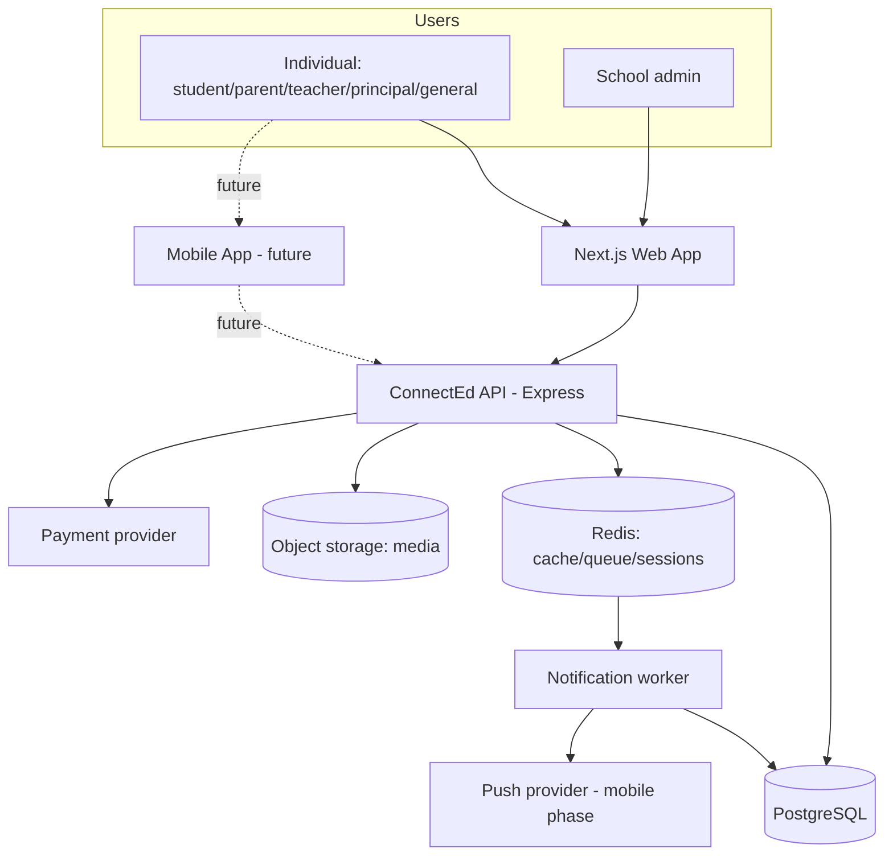
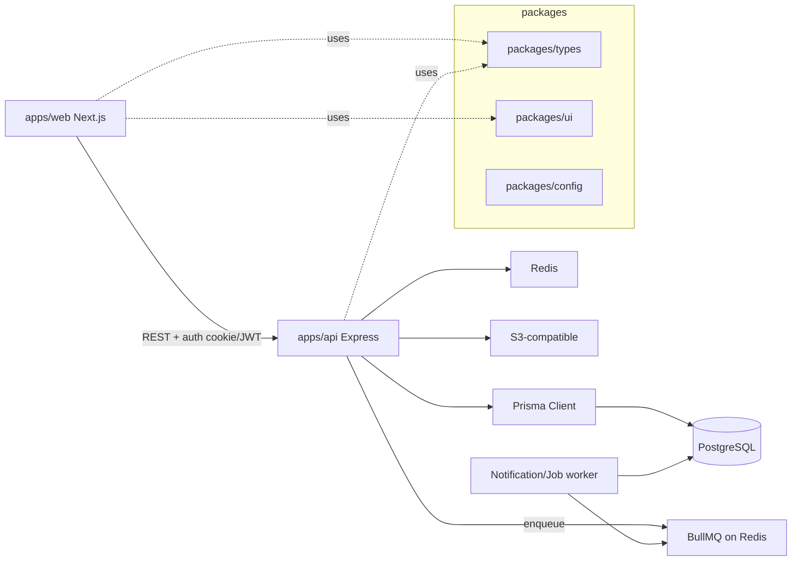
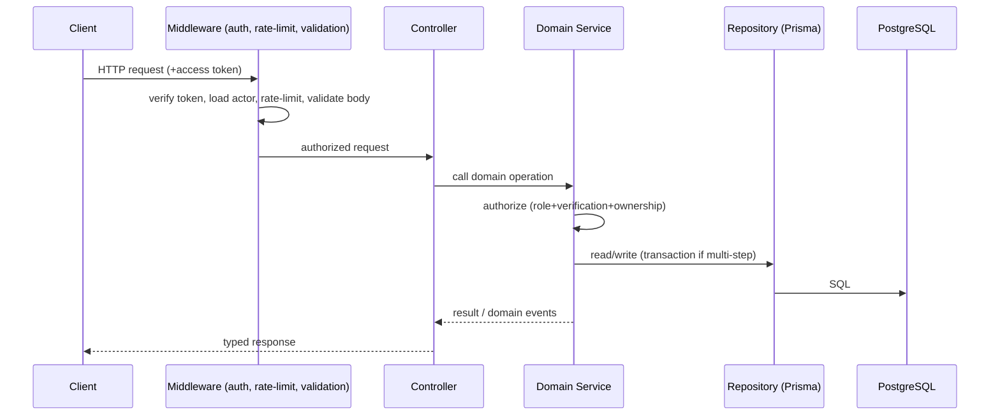

# Architecture — Overview

`Status: Accepted` · `Last updated: 2026-07-28`

## Guiding principles

1. **The API is the only authority.** Clients (web now, mobile later) hold no business rules and never touch the
   database. This is the central reversal from the legacy Firebase design.
2. **Server-enforced authorization** on every request (role + verification + ownership).
3. **Stateless, horizontally scalable API**; all shared state in Postgres/Redis/object storage.
4. **Modular monolith first.** One deployable API organized into clear domain modules with enforced boundaries;
   extract services only when a boundary demonstrably needs independent scaling (`ADR-0012`).
5. **Transactional writes**, idempotent side effects, async fan-out via a job queue.

## C4 — Context

## C4 — Container

## Domain modules (inside the API)

`auth` · `accounts` · `institution` (schools, classes, subjects) · `verification` · `academics`
(homework/notices/events/timetable/syllabus) · `workflows` (leave, complaints) · `social` (posts/follow/
messaging) · `notifications` · `billing`. Each module owns its routes, services, repository access, and domain
types. Cross-module calls go through service interfaces, not direct table access. See
[`01-modules.md`](./01-modules.md).

## Request lifecycle

See also: [`01-modules.md`](./01-modules.md), [`02-sequence-flows.md`](./02-sequence-flows.md),
[`03-frontend-architecture.md`](./03-frontend-architecture.md).
