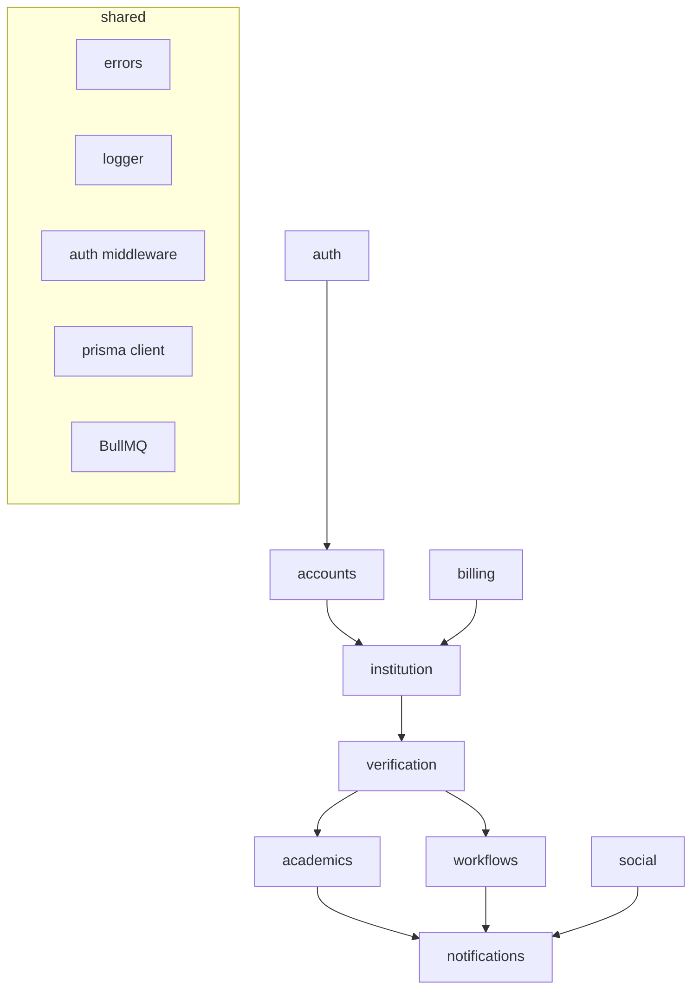

# Architecture — Module Boundaries

`Status: Accepted` · `Last updated: 2026-07-28`

The API is a **modular monolith**. Each module is a folder under `apps/api/src/modules/<name>` with a strict
internal shape and explicit public surface.

## Module anatomy

```
modules/<name>/
  <name>.routes.ts        # Express router; HTTP only
  <name>.controller.ts    # request/response mapping; no business logic
  <name>.service.ts       # domain logic + authorization; the module's core
  <name>.repository.ts    # all Prisma access for this module
  <name>.schema.ts        # zod request/response validation
  <name>.types.ts         # domain types (re-exported to packages/types when shared)
  <name>.events.ts        # domain events emitted (e.g. homework.published)
  __tests__/              # unit + integration tests
  index.ts                # public surface: service interface + router
```

## Boundary rules

1. A module may import **another module's `index.ts` service interface only** — never its repository or Prisma
   models directly.
2. Repositories are the **only** place Prisma is used. Services depend on repository interfaces.
3. Controllers contain no business rules; services own authorization.
4. Shared cross-cutting concerns live in `apps/api/src/shared` (errors, logger, auth middleware, db client,
   queue, config).
5. Domain events are the preferred cross-module integration for side effects (e.g. `academics` emits
   `homework.published`; `notifications` subscribes) — avoids tight coupling.

## Module map

| Module | Owns | Key events emitted |
|---|---|---|
| `auth` | credentials, tokens, sessions | `user.registered`, `user.loggedIn` |
| `accounts` | user/school profiles, roles | `role.declared` |
| `institution` | schools, classes, subjects, class-teacher allocation | `class.created`, `classTeacher.allocated` |
| `verification` | verification requests + decisions | `verification.submitted`, `verification.decided` |
| `academics` | homework/assignment/project, notice, event, timetable, syllabus | `homework.published`, `notice.published`, `event.created` |
| `workflows` | leave applications, complaints/suggestions | `leave.submitted`, `leave.decided`, `complaint.submitted` |
| `social` | posts, likes, comments, follow, connections, messages | `post.created`, `message.sent`, `connection.requested` |
| `notifications` | notification records, dispatch, preferences, push tokens | `notification.dispatched` |
| `billing` | plans, subscriptions, entitlements, webhooks | `subscription.changed` |

## Dependency direction



Boundaries are enforced in review and (where practical) by lint rules / import restrictions in
`packages/config`.
