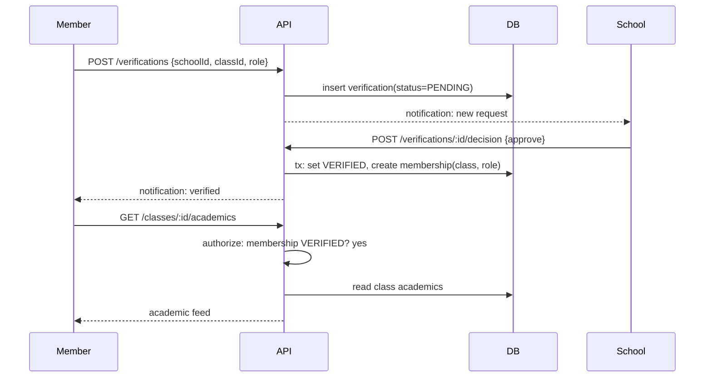
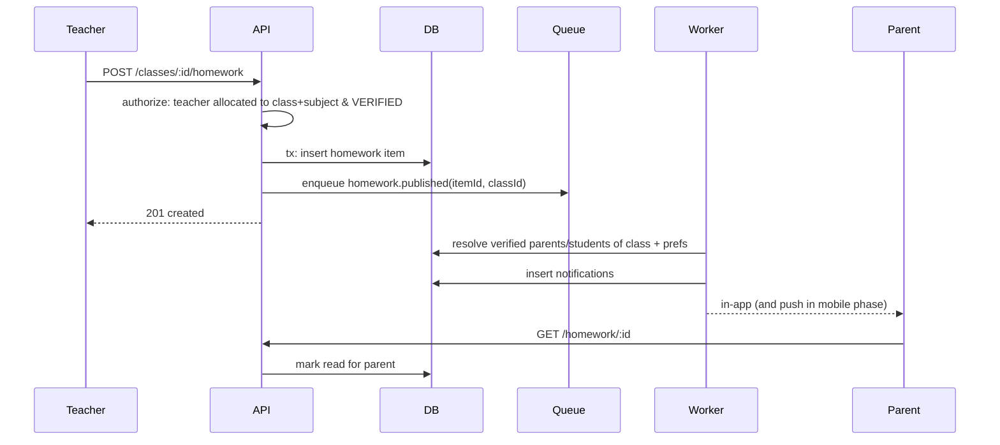
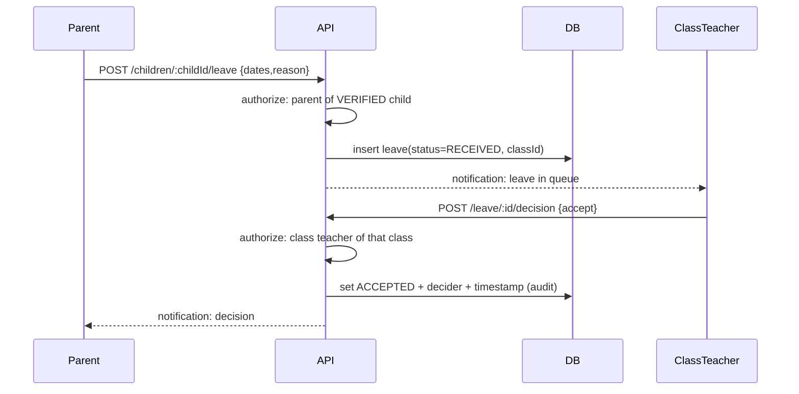

# Architecture — Key Sequence Flows

`Status: Accepted` · `Last updated: 2026-07-28`

## Member verification → academic unlock



## Teacher publishes homework → parents notified



## Auth: login with refresh rotation

```mermaid
sequenceDiagram
  participant Client
  participant API
  participant DB
  Client->>API: POST /auth/login {email,password, clientType}
  API->>DB: load account by email
  API->>API: verify argon2id hash; reject SCHOOL on mobile clientType
  API->>DB: create refresh-token family (hashed)
  API-->>Client: access JWT (15m) + refresh (httpOnly cookie)
  Note over Client,API: later...
  Client->>API: POST /auth/refresh (cookie)
  API->>DB: validate refresh; detect reuse
  alt reuse detected
    API->>DB: revoke family
    API-->>Client: 401 (re-login)
  else valid
    API->>DB: rotate refresh
    API-->>Client: new access + new refresh
  end
```

## Leave application (parent → class teacher)


