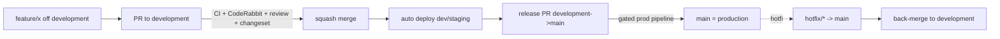

# CI/CD — Git Flow & Branching

`Status: Accepted` · `Last updated: 2026-07-28`

The exact flow requested: **feature branch → PR to `development` → merge → PR `development` → `main`
(production).**

## Branches

| Branch | Role | Protected | Deploys to |
|---|---|:--:|---|
| `main` | Production. Always releasable. | ✅ | production (gated) |
| `development` | Integration. Default PR target. | ✅ | dev/staging |
| `feature/*` | New work. Branch off `development`. | — | preview (optional) |
| `fix/*`, `chore/*`, `docs/*` | Same as feature, typed by intent. | — | preview |
| `hotfix/*` | Urgent prod fix; branch off `main`, PR to `main` **and** back-merge to `development`. | — | production |

## Rules

1. **Never commit directly** to `main` or `development` — PRs only.
2. Branch off `development`; open a PR **into `development`**.
3. A PR must: pass CI, include a **Changeset** (if shippable code changed), get **1+ human approval**
   (CODEOWNERS) and pass **CodeRabbit** review, follow **Conventional Commits**.
4. Merge strategy: **squash** into `development` (clean history); the `development → main` release PR uses a merge
   commit to preserve the release boundary.
5. Production releases go out via a **`development → main` release PR** (Changesets version/changelog).
6. `hotfix/*` may go straight to `main` (gated) and must be back-merged to `development`.

## Lifecycle

## Conventions

- **Commits:** Conventional Commits (`feat:`, `fix:`, `docs:`, `chore:`, `refactor:`, `test:`, `ci:`), enforced
  by commitlint (Husky `commit-msg`).
- **PR title** = Conventional Commit style; description references the requirement/issue and includes a test plan.
- **Changesets:** `pnpm changeset` per PR that changes shippable packages; release PR consumes them.
- **CODEOWNERS** routes reviews (e.g. `prisma/` → DBA/architect; `apps/web` → frontend; `.docs/Security` →
  security).
