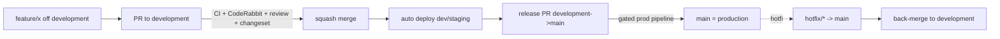

# CI/CD — Git Flow & Branching

`Status: Accepted` · `Last updated: 2026-07-28`

The exact flow requested: **feature branch → PR to `development` → merge → PR `development` → `main`
(production).**

## Branches

| Branch                       | Role                                                                                  | Protected | Deploys to         |
| ---------------------------- | ------------------------------------------------------------------------------------- | :-------: | ------------------ |
| `main`                       | Production. Always releasable.                                                        |    ✅     | production (gated) |
| `development`                | Integration. Default PR target.                                                       |    ✅     | dev/staging        |
| `feature/*`                  | New work. Branch off `development`.                                                   |     —     | preview (optional) |
| `fix/*`, `chore/*`, `docs/*` | Same as feature, typed by intent.                                                     |     —     | preview            |
| `hotfix/*`                   | Urgent prod fix; branch off `main`, PR to `main` **and** back-merge to `development`. |     —     | production         |

## Rules

1. **Never commit directly** to `main` or `development` — PRs only.
2. Branch off `development`; open a PR **into `development`**.
3. A PR must: pass CI, include a **Changeset** (if shippable code changed), get **1+ human approval**
   (CODEOWNERS) and pass **CodeRabbit** review, follow **Conventional Commits**.
4. Merge strategy: **squash** into `development` (clean history); the `development → main` release PR uses a merge
   commit to preserve the release boundary.
5. Production releases go out via a **`development → main` release PR** (Changesets version/changelog).
6. `hotfix/*` may go straight to `main` (gated) and must be back-merged to `development`.
7. **Back-merge every release into `development` — with a merge commit, never a squash.**
   A squash re-applies `main`'s content as a new commit without recording `main` as an ancestor,
   so the next release conflicts on exactly the files the back-merge was meant to carry. That has
   now happened twice: once across 176 files, and once on the version bump itself. `changeset version` runs on the release branch,
   so after the merge `main` carries the version bump and the consumed changesets and `development`
   does not. Left alone the next release re-publishes the same changelog and bumps from the same
   number — and the drift is what made an earlier release PR conflict across 176 files.

   **Name the branch `chore/back-merge-<version>`.** CI reads it: `changeset-check` is skipped on a
   back-merge, because the release commit it carries is a version bump with every changeset already
   consumed, and no changeset could be added that would not publish the same version twice. A
   back-merge branch named anything else fails that check for a reason nobody can act on.

## Lifecycle

## Conventions

- **Commits:** Conventional Commits (`feat:`, `fix:`, `docs:`, `chore:`, `refactor:`, `test:`, `ci:`), enforced
  by commitlint (Husky `commit-msg`).
- **PR title** = Conventional Commit style; description references the requirement/issue and includes a test plan.
- **Changesets:** `pnpm changeset` per PR that changes shippable packages; release PR consumes them.
  A change to a **private** package (`@connected/api`, `@connected/web`) takes an **empty** changeset
  (`---\n---`). Naming an ignored package instead is a trap: its changeset is never consumed, so it
  survives every `changeset version` and the release workflow believes forever that something is
  left to publish.
- **CODEOWNERS** routes reviews (e.g. `prisma/` → DBA/architect; `apps/web` → frontend; `.docs/Security` →
  security).

## Release tags

Every release to `main` is tagged `release/YYYY-MM-DD`, suffixed `.2`, `.3` when a day carries more
than one. The workflow creates the tag and a GitHub Release with generated notes, on any push to
`main` whose head commit mentions `release/` — which is what a merge from a `release/*` branch
produces, and what a hotfix does not.

**Dates rather than versions.** This tags the _product_: the only versioned package in the
repository is a shared types library, and its number says nothing about what a school will see.

The first two releases were tagged by hand after the fact — `release/2026-08-01` for Sprint 2 and
`release/2026-08-04` for Sprints 3–5 — because for its first five sprints this repository had no
tags at all, and nothing distinguished the commit that went to production from the forty-odd merged
the same week.
