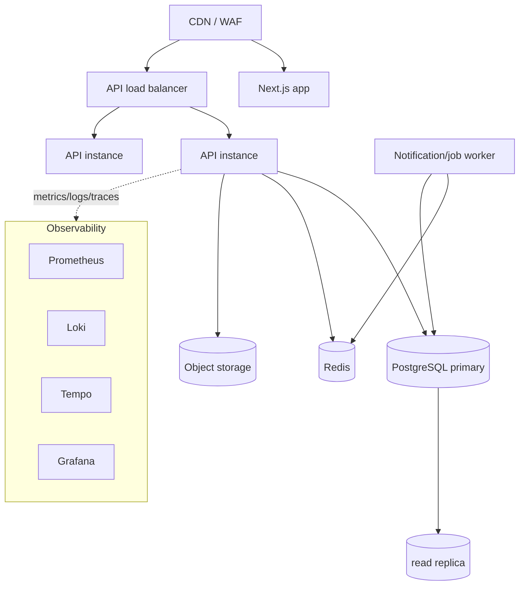

# Deployment — Environments & Topology

`Status: Accepted` · `Last updated: 2026-07-28`

## Environments

| Env | Purpose | Data | Deploy trigger |
|---|---|---|---|
| `local` | Developer machine | Seed/demo (Docker Compose) | manual |
| `dev` | Integration | Anonymized/seed | merge to `development` |
| `staging` | Pre-prod, prod-like | Anonymized | merge to `development` (or release candidate) |
| `production` | Live | Real | merge to `main` (gated) |

12-factor config: everything via env vars. No env-specific code branches.

## Topology (production)

- **API**: stateless, ≥2 replicas behind a load balancer, autoscaled on CPU/RPS.
- **Web**: Next.js (Node server for SSR or platform edge). Static/ISR assets via CDN.
- **DB**: managed Postgres, primary + read replica, automated backups + PITR.
- **Redis**: managed/HA for cache + queue.
- **Worker**: separate process/deployment consuming BullMQ (first candidate for extraction).
- **Object storage**: S3/compatible + CDN for public assets.

## Packaging

- Multi-stage Docker images for `apps/api`, `apps/web`, and the worker. Minimal runtime base, non-root user,
  pinned deps, image scanning in CI (`ADR-0010`, `infrastructure/docker`).
- Orchestration: Docker Compose (local) → Kubernetes/Helm or a PaaS (staging/prod) — see
  `infrastructure/kubernetes` & `infrastructure/helm`. Final prod platform chosen at deploy time (its own ADR).

## Config & secrets

- Non-secret config in env per environment.
- Secrets from a secrets manager (never in repo); injected at runtime. `.env.example` documents required keys.
