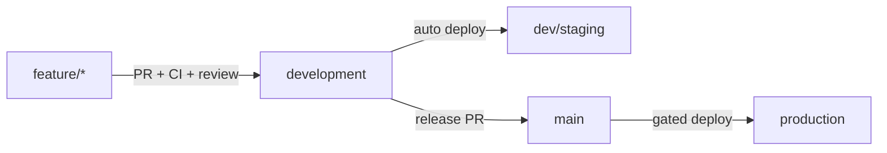

# Deployment — Release Process

`Status: Accepted` · `Last updated: 2026-07-28`

## Flow (ties to git flow)

## Steps

1. **Merge to `development`** → CI builds images, runs `migrate deploy` on dev/staging DB, deploys API+web+worker
   to dev/staging, runs smoke + E2E.
2. **Release PR `development` → `main`** → Changesets aggregates changelog + version bumps; final review.
3. **Merge to `main`** → gated production pipeline:
   - Pre-flight: backup checkpoint + PITR marker if the release contains schema changes.
   - `prisma migrate deploy` (expand-phase migrations only; backwards-compatible).
   - Deploy API (rolling), then web, then worker.
   - Post-deploy smoke tests + health checks; watch error-rate/latency for a bake period.
4. **Tag** the release; publish changelog.

## Deployment strategies

- **Rolling** default for API/worker (stateless).
- **Canary** for risky changes (route a small % first; auto-rollback on SLO breach).
- **Feature flags** decouple deploy from release; kill switches for risky features.
- **DB zero-downtime**: expand → deploy → backfill → contract (never break the running version).

## Rollback

- App: redeploy previous image (immutable tags).
- DB: forward-fix preferred; destructive migrations gated and reversible-planned; PITR as last resort
  (`Runbooks/db-restore.md`).
- Every release records: version, migration list, rollback plan.

## Gates (must pass before prod)

Lint · type-check · unit + integration + permission-matrix tests · build · security scan · Lighthouse/a11y
(web) · successful staging deploy + smoke. See [`../Checklists/`](../Checklists/).
