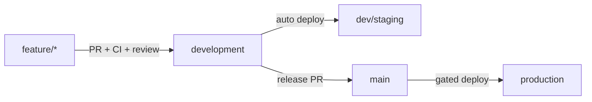

# Deployment — Release Process

`Status: Accepted` · `Last updated: 2026-08-08`

## Flow (ties to git flow)

## What is actually wired, as of 2026-08-08

This document has described the intended pipeline since Sprint 2. Most of it is still intent, and
the parts that are real are worth separating from the parts that are not — a release process nobody
can tell the truth about is worse than a short one.

| Step                       | State                                                                    |
| -------------------------- | ------------------------------------------------------------------------ |
| CI on every PR             | ✅ lint, type-check, tests, E2E, image build + scan                      |
| Tag + GitHub Release       | ✅ on every merge to `main` from a `release/*` branch                    |
| **Build and push images**  | ✅ **S9-3** — `api`, `migrate` and `web` to `ghcr.io`, tagged by release |
| `migrate deploy` on deploy | ⏳ the image exists and nothing runs it — S9-4                           |
| Deploy to dev/staging/prod | ⏳ no environment exists yet — S9-0a, S9-4                               |
| Post-deploy smoke          | ◐ the test exists (`pnpm --filter web test:smoke`); nothing gates on it  |
| Rollback by redeploying    | ⏳ needs somewhere to deploy                                             |

### The images

Three, from two Dockerfiles in [`../../infrastructure/docker/`](../../infrastructure/docker/):

| Image     | What                                                                            |
| --------- | ------------------------------------------------------------------------------- |
| `api`     | The API **and** the worker — one artefact, two commands (`node dist/worker.js`) |
| `migrate` | `prisma migrate deploy`, and nothing else. Runs once and exits                  |
| `web`     | The Next.js app, standalone output                                              |

Tagged with the release date — `2026-08-08.2` for `release/2026-08-08.2` — and **never `latest`**.
`latest` is the tag that makes an incident unanswerable: two machines pulling it a week apart run
different code and both report the same version. Each release's notes carry the digests, because the
question "which image is that release?" gets asked by somebody with the release page open and no
terminal.

The API and the worker share an image deliberately. S7-17 found `worker.ts` and `index.ts` had
drifted in a way that type-checked and left every class fan-out reaching nobody; two images built
from one source is one more chance at that.

## Steps

1. **Merge to `development`** → CI builds images, runs `migrate deploy` on dev/staging DB, deploys API+web+worker
   to dev/staging, runs smoke + E2E.
2. **Release PR `development` → `main`** → Changesets aggregates changelog + version bumps; final review.
3. **Merge to `main`** → gated production pipeline:
   - Pre-flight: backup checkpoint + PITR marker if the release contains schema changes.
   - `prisma migrate deploy` (expand-phase migrations only; backwards-compatible).
   - Deploy API (rolling), then web, then worker.
   - Post-deploy smoke tests + health checks; watch error-rate/latency for a bake period.
4. **Tag** the release; publish changelog.

## Deployment strategies

- **Rolling** default for API/worker (stateless).
- **Canary** for risky changes (route a small % first; auto-rollback on SLO breach).
- **Feature flags** decouple deploy from release; kill switches for risky features.
- **DB zero-downtime**: expand → deploy → backfill → contract (never break the running version).

## Rollback

- App: redeploy previous image (immutable tags).
- DB: forward-fix preferred; destructive migrations gated and reversible-planned; PITR as last resort
  (`Runbooks/db-restore.md`).
- Every release records: version, migration list, rollback plan.

## Gates (must pass before prod)

Lint · type-check · unit + integration + permission-matrix tests · build · security scan · Lighthouse/a11y
(web) · successful staging deploy + smoke. See [`../Checklists/`](../Checklists/).
