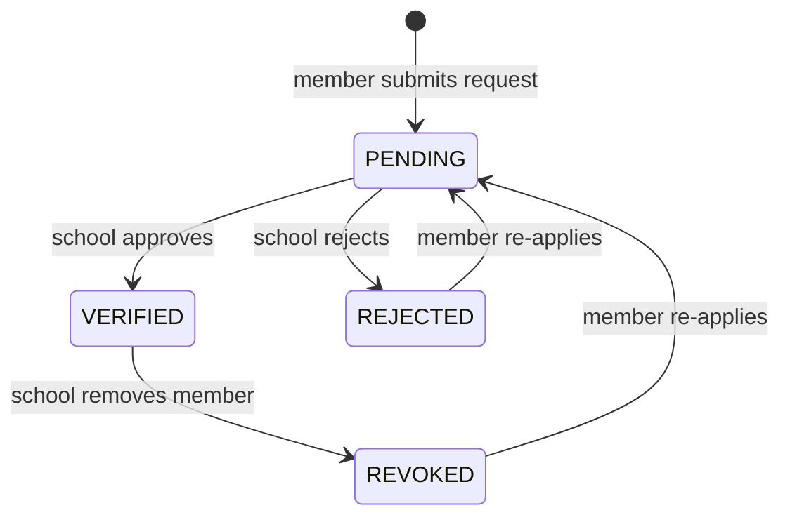

# PRD — Verification Workflow

`Status: Accepted` · `Last updated: 2026-07-28`

The spine of the product. A member self-declares an academic role; the **school approves** it before any class
academic data is accessible.

## States

`PENDING` → (`VERIFIED` | `REJECTED`). A rejected member may re-apply. A verified member may be **revoked** by the
school (→ effectively removed).

## Requirements

| ID | Priority | Requirement | Acceptance criteria |
|---|:--:|---|---|
| FR-VER-001 | P0 | A student submits a verification request to a school for a specific class. | Creates a `PENDING` request scoped to (school, class, role=STUDENT). |
| FR-VER-002 | P0 | A parent submits, per child, a request naming the child's school + class. | One request per child; parent gains child-scoped access only after approval. |
| FR-VER-003 | P0 | A teacher submits a request naming the school + subjects they teach. | `PENDING` teacher request with declared subjects. |
| FR-VER-004 | P0 | A principal submits a request to a school. | `PENDING` principal request. |
| FR-VER-005 | P0 | The school reviews pending requests and approves or rejects. | Decision recorded with actor + timestamp (audit). On approve → `VERIFIED`; academics unlock. |
| FR-VER-006 | P0 | **Server denies all academic access while not `VERIFIED`.** | Any academic read/write by a non-verified member → 403. |
| FR-VER-007 | P1 | Requester and school are notified on submission and decision. | In-app notification on each transition; push in mobile phase. |
| FR-VER-008 | P1 | School can revoke a verified member. | Access removed immediately; audit entry written. |
| FR-VER-009 | P2 | Bulk verification (approve many at once). | School can multi-select pending requests and approve/reject in one action. |

## Access implications (server-enforced)

- Verified **student** → read academics of their one class.
- Verified **parent** → read academics of each verified child's class; act *for the child* (leave).
- Verified **teacher** → read/write academics for allocated subjects+classes; if class teacher, approve that
  class's student/parent leave.
- Verified **principal** → read academics school-wide; approve teacher leave.

## Anti-abuse

- A member cannot approve their own request (only the school can).
- Rate-limit re-applications; audit repeated rejects.
