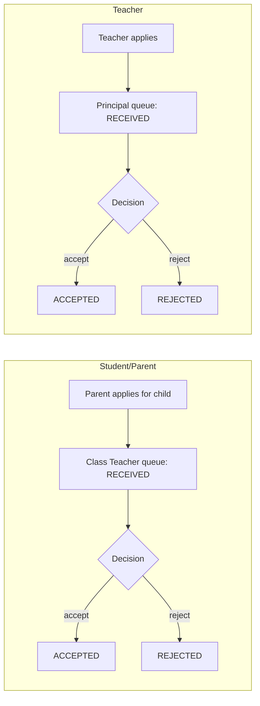

# PRD — Workflows (Leave, Complaints)

`Status: Accepted` · `Last updated: 2026-07-28`

## Leave applications

Two chains, both with states `RECEIVED` → (`ACCEPTED` | `REJECTED`):

- **Student/Parent leave** → approved by the **class teacher** of that class.
- **Teacher leave** → approved by the **principal**.

| ID | Priority | Requirement | Acceptance criteria |
|---|:--:|---|---|
| FR-WF-001 | P0 | A parent applies for a verified child's leave (dates, reason). | Application enters the child's class-teacher `RECEIVED` queue. |
| FR-WF-002 | P0 | A teacher applies for their own leave. | Application enters the principal's `RECEIVED` queue. |
| FR-WF-003 | P0 | The class teacher accepts/rejects student/parent leave for **their allocated class only**. | Server rejects decisions on other classes; status + decider recorded (audit). |
| FR-WF-004 | P0 | The principal accepts/rejects teacher leave. | Only principal role; audit recorded. |
| FR-WF-005 | P1 | Applicant sees status and is notified on decision. | Status visible; notification on transition. |
| FR-WF-006 | P1 | School/principal has read visibility into class leave queues. | View-only oversight. |
| — | — | **Students** have the Leave module **hidden** (carried from legacy). Parents apply on the child's behalf. | Student UI does not expose leave submission. |

## Complaints & Suggestions

| ID | Priority | Requirement | Acceptance criteria |
|---|:--:|---|---|
| FR-WF-010 | P0 | Parents/teachers/principal submit complaints or suggestions to the school. | Recorded, categorized (complaint/suggestion), timestamped. |
| FR-WF-011 | P0 | School/principal reviews complaints; teachers have view visibility. | Review list; status (open/reviewed); audit. |
| FR-WF-012 | P1 | Submitter notified when reviewed. | Notification on status change. |
| — | — | **Students** have Complaints **hidden** (carried from legacy). | Not exposed in student UI. |
