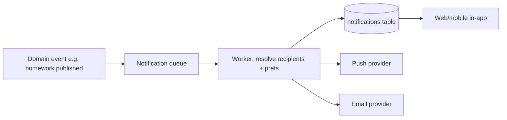

# PRD — Notifications

`Status: Accepted` · `Last updated: 2026-07-28`

A **server-owned** notification service (reverses legacy client-side Expo push). In-app first; push in the mobile
phase.

## Channels

- **In-app** (v1): persisted notifications + unread badge, delivered via polling then websocket.
- **Push** (mobile phase): Expo/FCM/APNs, dispatched **from the server**, not the client.
- **Email** (selective): verification decisions, password reset, digests.

## Requirements

| ID | Priority | Requirement | Acceptance criteria |
|---|:--:|---|---|
| FR-NOTIF-001 | P0 | The server creates a notification on key events. | Events: verification submitted/decided, homework/notice/event published, leave decided, message received, connection request. |
| FR-NOTIF-002 | P0 | Notifications target the correct verified audience. | Homework → verified parents/students of the class only; server computes recipients. |
| FR-NOTIF-003 | P0 | Users see in-app notifications with read state. | List + unread count; mark read; deep-link to source. |
| FR-NOTIF-004 | P1 | Push tokens registered per device (mobile phase). | Token stored server-side against the user; multiple devices supported. |
| FR-NOTIF-005 | P1 | Delivery is asynchronous & retried. | Dispatch via queue/worker; failures retried with backoff; dead-letter after N. |
| FR-NOTIF-006 | P1 | Users manage notification preferences. | Per-category opt-out; respected by dispatcher. |
| FR-NOTIF-007 | P2 | Digest notifications (daily summary). | Opt-in daily digest email. |

## Delivery model

Non-functional: median publish→notify < 10 s; at-least-once delivery; idempotent by (event_id, recipient_id).
