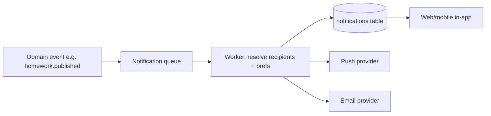

# PRD — Notifications

`Status: Accepted` · `Last updated: 2026-07-28`

A **server-owned** notification service (reverses legacy client-side Expo push). In-app first; push in the mobile
phase.

## Channels

- **In-app** (v1): persisted notifications + unread badge, delivered via polling then websocket.
- **Push** (mobile phase): Expo/FCM/APNs, dispatched **from the server**, not the client.
- **Email** (selective): verification decisions, password reset, digests.

## Requirements

| ID           | Priority | Requirement                                         | Acceptance criteria                                                                                                           |
| ------------ | :------: | --------------------------------------------------- | ----------------------------------------------------------------------------------------------------------------------------- |
| FR-NOTIF-001 |    P0    | The server creates a notification on key events.    | Events: verification submitted/decided, homework/notice/event published, leave decided, message received, connection request. |
| FR-NOTIF-002 |    P0    | Notifications target the correct verified audience. | Homework → verified parents/students of the class only; server computes recipients.                                           |
| FR-NOTIF-003 |    P0    | Users see in-app notifications with read state.     | List + unread count; mark read; deep-link to source.                                                                          |
| FR-NOTIF-004 |    P1    | Push tokens registered per device (mobile phase).   | Token stored server-side against the user; multiple devices supported.                                                        |
| FR-NOTIF-005 |    P1    | Delivery is asynchronous & retried.                 | Dispatch via queue/worker; failures retried with backoff; dead-letter after N.                                                |
| FR-NOTIF-006 |    P1    | Users manage notification preferences.              | **Built.** Per-category opt-out, respected by the dispatcher. Verification and billing are not switchable — see below.        |
| FR-NOTIF-007 |    P2    | Digest notifications (daily summary).               | Opt-in daily digest email.                                                                                                    |

## Preferences (FR-NOTIF-006)

The dispatcher has checked `isCategoryEnabled` since S2. **Nothing could set it** until S6: this
document and the endpoint catalogue both described `PATCH /me/notification-prefs`, and no such route
existed — a preference system nobody could reach, which from a user's chair is the same as not
having one.

Six categories are switchable: academic items, notices, events, leave, social, and messages.

**Verification and billing are not**, and that is a decision rather than an oversight. A student who
asked to join a school has to be told the answer, and the in-app notification is the only channel
that exists — an opt-out there is not a preference, it is a way to never hear back. Billing is the
school's contract with us. The settings page says so, because an absence with no explanation reads
as a bug.

Updates are **partial**: categories a request does not mention are left exactly as they were, or a
settings page would undo your last change every time you made a new one.

## Delivery model

Non-functional: median publish→notify < 10 s; at-least-once delivery; idempotent by (event_id, recipient_id).
