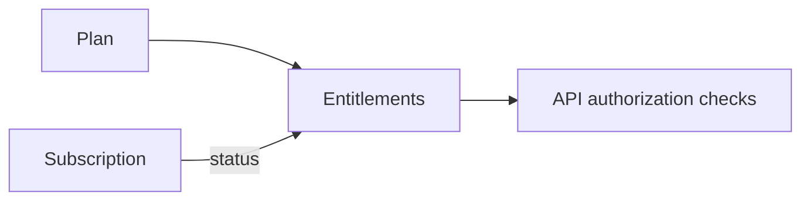

# PRD — Billing & Entitlements

`Status: Draft` · `Last updated: 2026-07-28`

School-subscription SaaS. Individuals are free (advertising funds the consumer side in a later phase).

## Concepts

- **Plan** — a named tier (e.g. Free/Pilot, Standard, Premium) with limits and features.
- **Subscription** — a school's active plan with billing period and status (`trialing | active | past_due | canceled`).
- **Entitlement** — the resolved set of feature flags/limits a school currently has.

## Requirements

| ID          | Priority | Requirement                                                | Acceptance criteria                                                  |
| ----------- | :------: | ---------------------------------------------------------- | -------------------------------------------------------------------- |
| FR-BILL-001 |    P0    | Schools start on a trial on registration.                  | Trial subscription created; entitlements reflect trial limits.       |
| FR-BILL-002 |    P1    | A school subscribes to a paid plan via a payment provider. | Provider (Stripe or Razorpay) checkout; on success → `active`.       |
| FR-BILL-003 |    P1    | Entitlements gate school features/limits server-side.      | e.g. max classes, max members, advanced analytics — enforced by API. |
| FR-BILL-004 |    P1    | Webhooks reconcile subscription state.                     | Provider webhooks update status; signature-verified; idempotent.     |
| FR-BILL-005 |    P1    | Dunning on failed payment.                                 | `past_due` grace period; notifications; downgrade on cancel.         |
| FR-BILL-006 |    P2    | Invoices & billing history for school admins.              | Downloadable invoices; history list.                                 |

## Provider decision

Deferred to an ADR at implementation time (`ADR-00xx`). Candidates: **Stripe** (global), **Razorpay** (India-first,
matches the legacy market). Region of pilot schools drives the choice.

## Entitlement resolution

