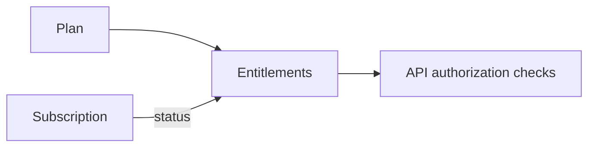

# PRD — Billing & Entitlements

`Status: Draft` · `Last updated: 2026-08-04`

School-subscription SaaS. Individuals are free (advertising funds the consumer side in a later phase).

## Concepts

- **Plan** — a named tier (e.g. Free/Pilot, Standard, Premium) with limits and features.
- **Subscription** — a school's active plan with billing period and status (`trialing | active | past_due | canceled`).
- **Entitlement** — the resolved set of feature flags/limits a school currently has.

## Requirements

| ID          | Priority | Requirement                                                | Acceptance criteria                                                  |
| ----------- | :------: | ---------------------------------------------------------- | -------------------------------------------------------------------- |
| FR-BILL-001 |    P0    | Schools start on a trial on registration.                  | Trial subscription created; entitlements reflect trial limits.       |
| FR-BILL-002 |    P1    | A school subscribes to a paid plan via a payment provider. | Provider (Stripe or Razorpay) checkout; on success → `active`.       |
| FR-BILL-003 |    P1    | Entitlements gate school features/limits server-side.      | e.g. max classes, max members, advanced analytics — enforced by API. |
| FR-BILL-004 |    P1    | Webhooks reconcile subscription state.                     | Provider webhooks update status; signature-verified; idempotent.     |
| FR-BILL-005 |    P1    | Dunning on failed payment.                                 | `past_due` grace period; notifications; downgrade on cancel.         |
| FR-BILL-006 |    P2    | Invoices & billing history for school admins.              | Downloadable invoices; history list.                                 |

## The plan catalogue

**The numbers below are provisional and belong to product, not engineering** (S5-0b). They are what
`apps/api/src/modules/billing/plan-catalogue.ts` currently applies, so that entitlement enforcement
could be built and tested against something real. `null` means unlimited.

| Code       | Classes | Members | Advanced analytics |
| ---------- | ------: | ------: | :----------------: |
| `trial`    |       5 |     200 |         ➖         |
| `standard` |      40 |    1500 |         ➖         |
| `premium`  |     _∞_ |     _∞_ |         ✅         |

The catalogue lives in code and is applied to the table idempotently at API boot. Changing a limit
is a reviewed one-line edit and a restart — the table follows the code, never the other way round,
so a limit cannot be quietly widened for one customer in production.

**`trial` is also the floor.** A cancelled subscription resolves to it rather than to nothing: the
school keeps every class and member it already has, and simply cannot add beyond the free level
until it subscribes again. Cancelling is not deleting.

**Trial length is 30 days**, applied at registration in the same statement that creates the school.

## Where entitlements are enforced (FR-BILL-003)

| Limit     | The write that consumes it       | Counted as                      |
| --------- | -------------------------------- | ------------------------------- |
| `classes` | `POST /schools/:id/classes`      | Classes belonging to the school |
| `members` | Approving a verification request | **Verified** memberships only   |

`advancedAnalytics` gates `GET /schools/:id/analytics` (S6-7). It is a **feature flag**, not a count,
so there is no write to intercept — the check happens on a read.

**That is the single exception to "reads are never gated", and the reasoning is narrow on purpose.**
The rule exists so a commercial dispute cannot become a student unable to see their own homework: a
timetable belongs to the school whatever it pays, and withholding it punishes the wrong people.
Analytics is not that. It is a report _we_ compute; it is not the school's data being withheld, and
it does not exist until the school buys it.

The test that keeps the exception narrow asserts the negative: a school refused analytics can still
read its classes, its notices, and everything it wrote. **Anything that gates a read of data the
school itself created is on the wrong side of this line.**

A school without the feature gets `402 FEATURE_NOT_IN_PLAN` naming the feature and the plan that
includes it — a sibling of `PLAN_LIMIT_EXCEEDED` and deliberately a different code: "you have used
all five" and "your plan never included this" lead to the same remedy but are different sentences.

Three rules hold everywhere a limit is enforced:

- **At the write that would exceed it, never retroactively.** A school that downgrades keeps every
  class and member it already has. Reads are never gated, so a plan limit can never become a
  student unable to see their own homework.
- **Authorization first, entitlement second.** A school acting on another school's data gets the
  404 it would have got anyway, rather than a 402 that confirms the other school exists.
- **Only approval consumes a seat.** People waiting in the verification queue do not count, or
  anyone could exhaust a school's plan from outside by applying; and a revoked membership gives its
  seat back, or a school would pay for people who have left.

A school that has run out of seats can still **reject** — a commercial limit must not turn into a
stuck workflow.

**Concurrency:** two simultaneous writes at the cap can both pass, leaving a school one over. That
is accepted deliberately; a plan limit is a commercial guardrail, not a security boundary.

## Provider decision

Deferred to an ADR at implementation time (`ADR-00xx`). Candidates: **Stripe** (global), **Razorpay** (India-first,
matches the legacy market). Region of pilot schools drives the choice.

## Entitlement resolution

