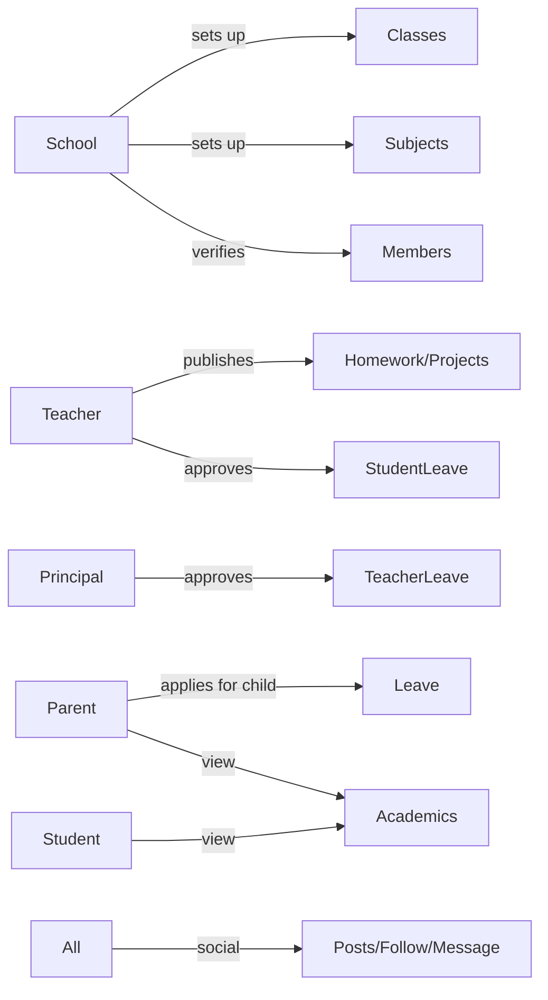

# User Personas

`Status: Accepted` · `Last updated: 2026-07-28`

Six actor types. Five are **individual users** (a single account model differentiated by role/status); one is an
**institution** (school). Every academic role must be **verified by a school** before class data unlocks.

| Actor | Platform | Verified? | Core scope |
|---|---|---|---|
| Student | Web (mobile later) | Yes, by school | One class of one school |
| Parent | Web (mobile later) | Yes, per child | One or more children, each in a class |
| Teacher | Web (mobile later) | Yes, by school | Subjects taught; optional class-teacher role |
| Principal | Web (mobile later) | Yes, by school | Whole school (oversight + teacher-leave approval) |
| General User | Web (mobile later) | N/A | Social features only |
| School (institution) | **Web only** | Is the verifier | Owns all academic + admin data |

---

## Priya — Student (Class 8, English medium)

- **Goals:** see today's homework, this week's timetable, what's due, school notices; keep a social profile.
- **Frustrations (legacy):** homework buried in a WhatsApp group; never sure what's official.
- **Needs:** a single "Today" view; read/unread clarity; reliable notifications.
- **Access:** view-only on academics; full social. Leave & Complaints modules hidden for students.

## Rahul — Parent of two children

- **Goals:** track each child's homework and leave; apply for a child's leave; raise complaints to the school.
- **Frustrations:** juggling two schools/classes; no proof a message was seen.
- **Needs:** child switcher; per-child feeds; formal leave workflow with status (received → accepted/rejected).
- **Access:** view child academics; submit leave *for the child*; submit complaints/suggestions.

## Sunita — Teacher (Science) & Class Teacher of 8-A

- **Goals:** publish homework/assignments/projects to her subject+class; update syllabus coverage; approve
  student/parent leave for her class; apply for her own leave to the principal.
- **Needs:** publish once → auto-notify verified parents; leave approval queue; syllabus tracker.
- **Access:** write to subjects/classes she is **verified and allocated** to only.

## Anil — Principal

- **Goals:** oversee the school, approve teacher leave, view academics, handle complaints.
- **Access:** view academics across the school; approve *teacher* leave; review complaints. (Whether a principal
  can publish homework is **No** by default — that is a teacher/school action; see permissions matrix.)

## Meera — General User

- **Goals:** use only the social layer — follow schools, connect with friends, post, message.
- **Access:** discovery + social. No academic modules.

## Greenwood Public School — Institution (admin: Mr. Kapoor)

- **Goals:** set up the school profile, classes (Medium+Class+Section) and subjects; verify members; allocate
  class teachers; publish notices, events and timetables; manage the academic system; manage subscription.
- **Platform:** **web only** (mobile login rejected).
- **Access:** owns and can write all of its own institutional and academic data; is the **verifier** for members.

---

## Persona → primary jobs-to-be-done

