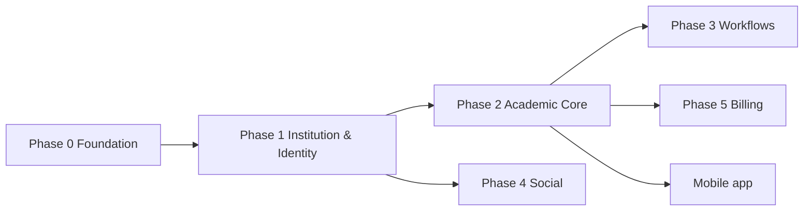

# Product Roadmap

`Status: Draft` · `Last updated: 2026-07-28`

Phased delivery. Each phase is shippable. Dates are relative to project kickoff (T0 = 2026-07-28).

## Phase 0 — Foundation (T0 → T0+3 weeks)

- Monorepo, CI/CD, environments, observability skeleton.
- Auth (register/login/refresh), account model, RBAC middleware.
- Postgres schema v1 + migrations; seed script.
- **No user-facing features yet** — platform is the deliverable.

## Phase 1 — Institution & identity (T0+3 → T0+7 wk)

- School onboarding: profile, classes (Medium+Class+Section), subjects.
- Member registration, role declaration, **verification workflow** (request → approve/reject).
- Class-teacher allocation.
- School portal shell (web).

## Phase 2 — Academic core (T0+7 → T0+12 wk)

- Homework / Assignments / Projects (publish, read-tracking).
- Notices & Events.
- Timetable (upload/view) & Syllabus coverage.
- Notifications service (in-app first; push in mobile phase).

## Phase 3 — Workflows (T0+12 → T0+15 wk)

- Leave applications (student/parent → class teacher; teacher → principal) with status queues.
- Complaints & Suggestions channel.

## Phase 4 — Social layer (T0+15 → T0+19 wk)

- Profiles, timeline posts, likes, comments.
- Follow (users & schools), friend connections/requests.
- Direct messaging.

## Phase 5 — Commercialisation (T0+19 → T0+22 wk)

- School subscription plans, entitlements, billing (Stripe/Razorpay).
- Admin/staff console.

## Later phases

- **Mobile app** (React Native/Expo) on the same API.
- Gradebook / report cards.
- Advanced analytics dashboards for schools.
- Advertising on consumer surface.

## Dependency graph

