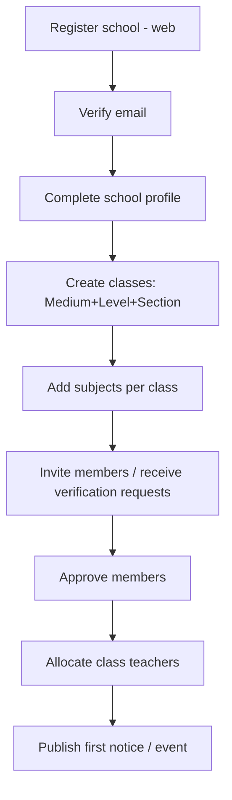
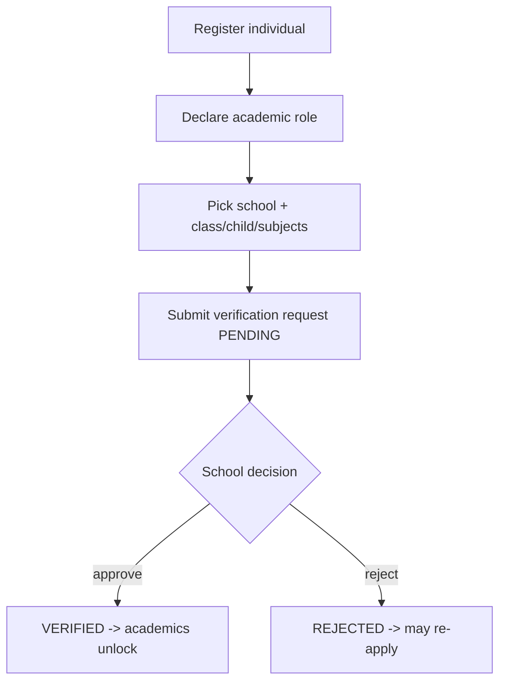
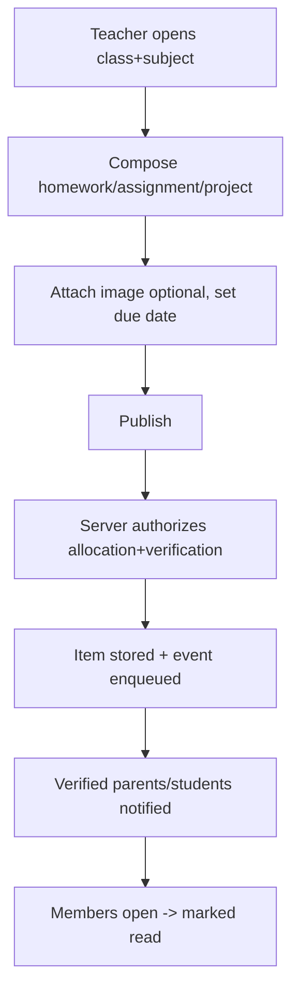
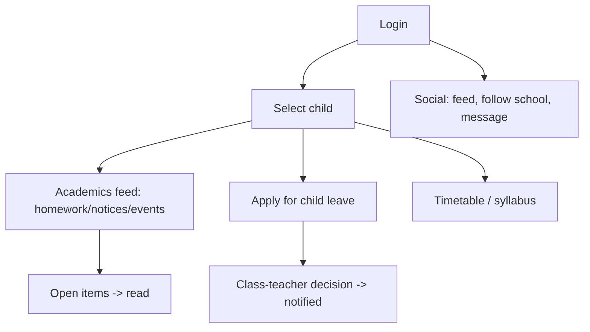
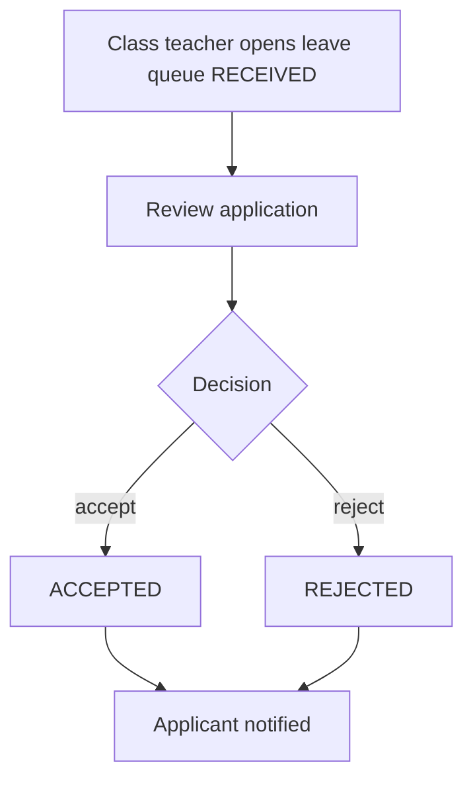
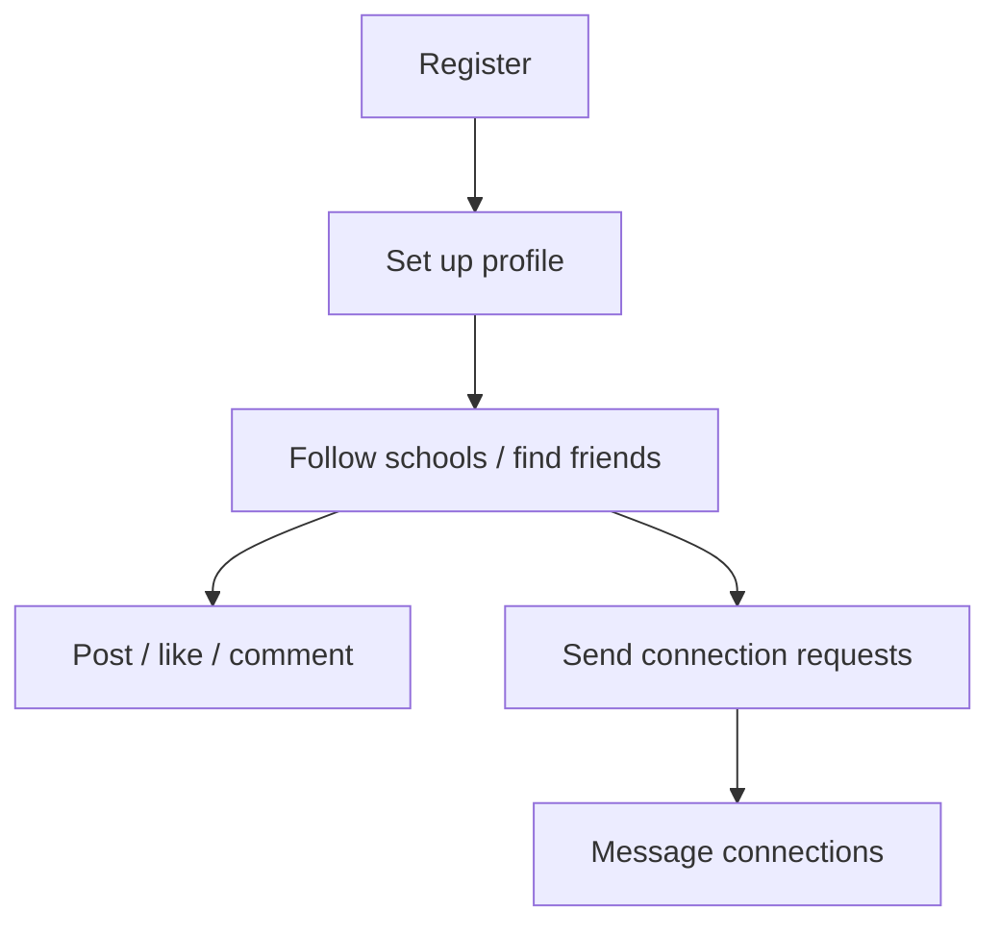

# User Flows

`Status: Accepted` · `Last updated: 2026-07-28`

End-to-end flows per role. Each references the PRD module and the API endpoints involved.

## School onboarding

Endpoints: `/auth/register/school`, `/schools/:id`, `/schools/:id/classes`, `/classes/:id/subjects`,
`/schools/:id/verifications`, `/classes/:id/class-teacher`, `/schools/:id/notices`.

## Member verification (student/parent/teacher/principal)

Endpoints: `/me/role`, `/verifications`, `/verifications/:id/decision`, `/me/verifications`.

## Teacher publishes homework

Endpoints: `/classes/:id/homework`, `/homework/:id`, `/notifications`.

## Parent daily use

## Leave approval (class teacher)

## Social onboarding (general user)

